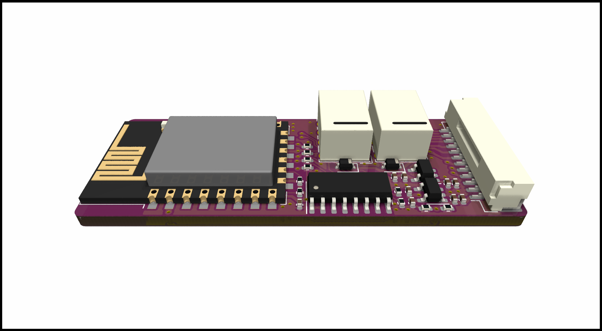
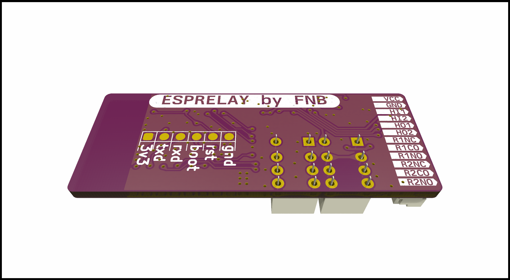

# ESPRELAY

It uses an[ESP32-WROOM-32E](./DOCUMENTATION/esp32-wroom-32e_esp32-wroom-32ue_datasheet_en.pdf) wifi module both communication and MCU, and is mostly based on surface mount components.

[SCHEMATIC](./DOCUMENTATION/_schematic.pdf)
## Specifications
| **Parameter**   | **Description**                                                     |
|-----------------|---------------------------------------------------------------------|
| _Input voltage_ | Usb-C cable, Header 4-6v, Direct 3.3v                               |
| _Current_       | Wifi: ##mA, Radio Off: ##mA, Deep sleep ##uA |
| _Communication_ | 2.4ghz WIFI, Uart TTL, Uart over USB                                |
| _Baudrate_      | 115200                                                              |
| _PCB size_      | XxXmm                                                            |
| _Case size_     | XxXxXmm                                                         |

## Serial port controll comands
TODO

## Description
TODO

## Homeassistant Implementation
TODO

## FRONT

## BACK

## FIRST PRODUCTION PROTOTYPE
TODO
## BUCK BOOST CONVERTER
TODO